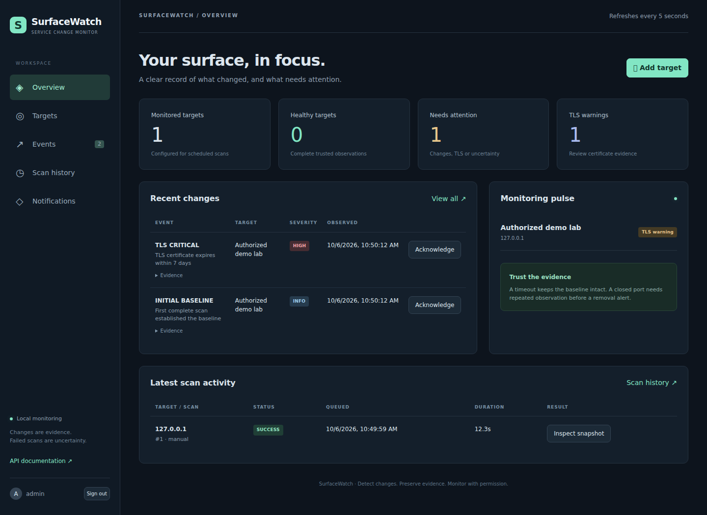

# SurfaceWatch

**Know when your external services change.** SurfaceWatch is a local-first,
authorized service change monitor for a cybersecurity portfolio or a small lab.
It tracks TCP services, DNS address sets and TLS certificates, retains scan
evidence, and reports meaningful changes against a trusted baseline.

It detects changes rather than vulnerabilities. Scan only assets you own or have
explicit permission to test. There is no exploitation, credential testing, UDP
scanning, subnet discovery or automatic vulnerability assessment.



## Quick start

Requirements: Git, Python 3.12+ for configuration generation, Docker Engine with
the Docker Compose plugin (`docker compose`, v2 or newer), and approximately 2 GB
of available RAM for a small lab. On Windows, use Linux containers in Docker Desktop
or a Docker Engine accessible from your shell; PowerShell examples are in DEMO.md.
The application needs no purchased domain, paid API, cloud hosting or subscription.
Your computer, electricity and optional notification providers are outside the
application's costs. All required services run locally.

```bash
git clone https://github.com/Sushinull/SurfaceWatch.git
cd SurfaceWatch
python scripts/setup.py
docker compose up --build -d
docker compose exec backend python -m app.cli create-user --username admin
```

Choose a password with 12–256 characters. Open **http://localhost:8080**, sign in,
select **Add target**, enter a domain/IP, choose a profile and explicitly confirm
authorization. Select **Scan** to queue the first observation. **API documentation**
in the sidebar opens FastAPI's OpenAPI interface at `/api/docs`.

**ภาษาไทย:** สร้างไฟล์ตั้งค่าด้วยคำสั่งด้านบน → เปิด Docker → สร้างบัญชี admin
→ เปิด `http://localhost:8080` → เพิ่ม target ที่ได้รับอนุญาต → กด Scan
หากสแกน IP ภายใน ให้เพิ่มช่วง IP ที่อนุญาตใน `ALLOWED_TARGET_CIDRS` ก่อน
จากนั้นใช้ `docker compose up -d --force-recreate backend worker` เพื่อโหลดค่าใหม่

Use `localhost` consistently. Using `127.0.0.1` in the browser requires changing
`APP_ORIGIN` to match. All published ports bind to the loopback interface.

## Features

- Authenticated target creation, editing, scheduling, manual scans and safe archive.
- Quick (21 TCP ports), Standard (55 TCP ports), and custom profiles (up to 1024 ports).
- Nmap TCP connect and light service/version detection; IPv4 and IPv6 support.
- Domain A/AAAA/CNAME history with order-independent comparison and pinned scan IPs.
- Direct TLS certificate metadata, fingerprint, renewal, expiry and hostname checks.
- PENDING, RUNNING, SUCCESS, PARTIAL and FAILED scan states.
- Immutable scan observations plus separate trusted-baseline and change-candidate state.
- Two consecutive complete observations before reporting a closed port as removed.
- Severity-based SMTP, Telegram or Discord notifications with retries and delivery history.
- Responsive React dashboard, target details, event filters and scan inspection.
- Database migrations, automated tests, dependency lockfile and GitHub Actions checks.
- An isolated local demo showing baseline, new service and confirmed closure.

## Architecture and stack

React + TypeScript + Vite is served by an unprivileged Nginx container. It calls
FastAPI through a same-origin `/api` proxy. FastAPI writes targets and jobs to
PostgreSQL 17. A separate Python worker polls durable due timestamps and jobs,
executes the DNS → Nmap → TLS → diff pipeline, commits history, and delivers
notifications from an outbox. HTTP requests do not execute scans.

Python 3.12, FastAPI, SQLAlchemy, Alembic, Psycopg, Argon2, cryptography, dnspython,
defusedxml and HTTPX are used in the backend. No Redis, Celery or Kubernetes is required.
See [architecture](docs/ARCHITECTURE.md) for baseline semantics and the schema.

## What the states mean

| State | Meaning | Updates trusted baseline? |
|---|---|---|
| PENDING | Durable job waiting for the worker | No |
| RUNNING | Observation in progress | No |
| SUCCESS | Complete requested address/port coverage and required TLS collection | Yes, after any pending closures are confirmed |
| PARTIAL | Some evidence exists, but coverage, TLS or port state is uncertain | No |
| FAILED | No usable complete observation, DNS failure, process/parser error or worker interruption | No |

`filtered`, missing XML coverage, timeouts and DNS errors never mean removed ports.
Every scan is retained. Port closure needs two **consecutive successful** observations;
a partial/failed scan resets its confirmation count. Changed host/profile starts a
new baseline while keeping all old history. Profile objects themselves are immutable.

TLS warning bands default to 30, 14 and 7 days, then expired at the certificate's
actual expiry time. Unchanged warnings are suppressed until their warning band or
certificate changes. Service detection is evidence, not an assertion of vulnerability.

## Configuration

`scripts/setup.py` creates a private, ignored `.env` with random application and
database secrets, and never overwrites an existing file. See `.env.example`.

| Variable | Default / purpose |
|---|---|
| `SECRET_KEY` | Generated; HMAC protects stored session tokens |
| `POSTGRES_PASSWORD` | Generated; Compose PostgreSQL authentication |
| `DATABASE_URL` | Native development DB URL; Compose supplies the internal DB URL |
| `APP_ORIGIN` | `http://localhost:8080`; exact browser origin for CSRF checks |
| `COOKIE_SECURE` | `false` for loopback HTTP; use `true` behind HTTPS |
| `ALLOWED_TARGET_CIDRS` | Explicit additional private/loopback ranges; demo subnet `172.30.0.0/24` |
| `MAX_TARGET_ADDRESSES` | 8; reject incomplete scanning of large address sets |
| `SCAN_TIMEOUT` | 180 seconds **per resolved IP** plus process grace |
| `TLS_TIMEOUT` | 5 seconds per certificate handshake |
| `REMOVAL_CONFIRMATIONS` | 2 consecutive complete observations |
| `TLS_WARNING_DAYS` / `TLS_SECOND_WARNING_DAYS` / `TLS_CRITICAL_DAYS` | 30 / 14 / 7 |
| `SESSION_HOURS` | 8; fixed session expiry |
| `WORKER_POLL_SECONDS` | 3 |

Public unicast addresses are permitted after user authorization. Private/loopback
addresses require a matching explicit CIDR. Unspecified and multicast addresses,
and `169.254.169.254`, are always refused. Domain names are validated and resolved
once; Nmap and TLS receive only those validated IPs, so DNS cannot redirect a
later connection to an unchecked address. Never expose the app to untrusted users.

## Scheduled scans and history

Enable monitoring and choose an interval (minimum five minutes). The first scheduled
scan is due one interval after creation; a manual scan can establish the baseline
immediately and resets the next due timestamp. A database partial unique index
prevents two PENDING/RUNNING jobs for one target. One worker process owns a
PostgreSQL advisory lock; additional workers exit. Due timestamps and jobs survive
restart. Interrupted RUNNING jobs become FAILED, preserving the trusted baseline.

Use target details for trusted services, certificate evidence, DNS and recent
target-specific history. The Events view filters by target, type, severity and time;
acknowledgment marks reviewed events. Archiving disables monitoring without deleting
any scan or event. Editing/archiving waits until an active scan completes.

## Free notifications

Configure credentials in `.env`, recreate **backend and worker**, then add a rule in
**Notifications**. Select the channel and minimum severity; send a test and inspect
its PENDING/SENT/FAILED history. Notifications are grouped by target scan and are
sent only for newly emitted events at or above the rule threshold.

- **SMTP:** set `SMTP_HOST`, `SMTP_PORT`, optional `SMTP_USER` / `SMTP_PASSWORD`,
  `SMTP_FROM`. Enter the recipient in the rule. STARTTLS is enabled by default.
- **Telegram:** set `TELEGRAM_BOT_TOKEN` and `TELEGRAM_CHAT_ID`. No destination is
  needed in the rule. External delivery requires internet and a user-managed bot.
- **Discord:** set `DISCORD_WEBHOOK_URL` to an HTTPS `discord.com/api/webhooks/...`
  URL. Mention parsing is disabled. No destination is needed in the rule.

Credentials are not sent to the frontend. SMTP can run entirely locally using the
included Mailpit demo; see [demo instructions](docs/DEMO.md). Delivery errors do
not change scan results. Failed deliveries retry up to three times with a delay.
CONFIGURED means channel settings are present; it is not a connectivity check.
Send test and SENT/received evidence confirm delivery. The demo shares SMTP settings
between API and worker and overrides real SMTP credentials with empty values.

```bash
docker compose up -d --force-recreate backend worker
# Include both -f files instead when running the demo.
```

## Native development

Install Python 3.12+, Node.js 22, PostgreSQL 17 (16+ is also supported) and Nmap.
Prepare a PostgreSQL role/database and set their URL in `.env`. You can also use
`docker compose up -d db` with the generated native `DATABASE_URL`.

```bash
python scripts/setup.py
python -m venv .venv
# Linux/macOS:
source .venv/bin/activate
# Windows PowerShell: .venv\Scripts\Activate.ps1
pip install -r backend/requirements-dev.txt
cd backend
python -m alembic upgrade head
python -m app.cli seed
python -m app.cli create-user --username admin
```

Start these in separate terminals from `backend/` (activate the same environment):

```bash
# Linux/macOS; on PowerShell first set $env:APP_ORIGIN='http://localhost:5173'
APP_ORIGIN=http://localhost:5173 python -m uvicorn app.main:app --reload
python -m app.worker
```

From `frontend/`: `npm ci && npm run dev`. Open `http://localhost:5173`. The dev
server proxies `/api` to `127.0.0.1:8000`. The backend reads `../.env` in native
development; process environment variables take precedence.

## Database migrations, backups and reset

Compose applies Alembic migrations through a one-shot `migrate` service before
the backend and worker start. For an existing installation:

```bash
docker compose run --rm migrate
# Native: cd backend && python -m alembic upgrade head
docker compose exec backend python -m app.cli reset-password --username admin
```

Native migration consistency: `python -m alembic check`. Development migration:
`python -m alembic revision --autogenerate -m 'describe schema change'`; review the
generated file, especially circular foreign keys and partial indexes.

Back up before upgrading. For example on Linux/macOS:

```bash
docker compose exec -T db sh -c 'pg_dump -U "$POSTGRES_USER" -d "$POSTGRES_DB"' > surfacewatch-backup.sql
```

Keep the backup private. `docker compose down` preserves database history;
`docker compose down -v` **deletes the database volume**.

## Tests and quality checks

```bash
cd backend
python -m pytest -q
python -m ruff check app tests migrations ../demo ../scripts
python -m ruff format --check app tests migrations ../demo ../scripts
# Explicit opt-in: tests bind and scan only local test services.
RUN_LIVE_LAB=1 python -m pytest -q
# Optional: TEST_DATABASE_URL=postgresql+psycopg://... tests isolated PostgreSQL schemas.
cd ../frontend
npm ci
npm run build
npx prettier --check 'src/**/*.{ts,tsx,css}' 'tests/**/*.mjs' '*.json' '*.ts' index.html
npm audit
```

The standard fixture suite uses SQLite for fast test isolation only. Production
requires PostgreSQL. GitHub Actions additionally checks native PostgreSQL migrations,
the same flows against isolated PostgreSQL schemas, live Nmap/TLS/SMTP, the frontend,
and real Docker/Mailpit delivery, abrupt worker recovery, scheduling and browser
smoke. The Docker acceptance script requires a fresh disposable project; never run
it against your installation. See [verification report](docs/PROJECT_REPORT.md) for tests
actually executed and any environment limits; a workflow's presence is not proof
that its run has passed.

## V1 freeze

`v1.0.0` is an annotated tag for the verified main commit. The release workflow
runs only after a push with the exact message `release: freeze SurfaceWatch v1.0.0`
passes all mandatory checks. It verifies the tested SHA is still main's HEAD
and refuses to overwrite an existing tag. The GitHub Release records the exact
source SHA and CI run. For a stable checkout after release, use `git checkout v1.0.0`.
This freeze covers authorized local portfolio/small-lab use. See
[release notes](docs/RELEASE_NOTES.md) for scope and limitations.

## Demo, security, troubleshooting and roadmap

- [Controlled demo steps](docs/DEMO.md)
- [Architecture and uncertainty policy](docs/ARCHITECTURE.md)
- [Security boundary and remaining limitations](docs/SECURITY.md)
- [Troubleshooting](docs/TROUBLESHOOTING.md)
- [Final project report and V2 roadmap](docs/PROJECT_REPORT.md)

Current limitations include one serial worker, direct TLS only (no STARTTLS), no
certificate-chain trust assessment, no vulnerability detection, no multi-tenant
deployment and no public hosting support. Domain record sets can legitimately
vary with CDNs or geographic DNS; address changes are evidence and do not imply
that disappeared IPs' ports closed. HOST_DOWN is reserved for independent confirmed
reachability evidence; the V1 TCP connect scanner does not label a timeout as down.

The application source is MIT licensed. Nmap is an external dependency under its
own license; consult upstream terms when redistributing images or binaries.
