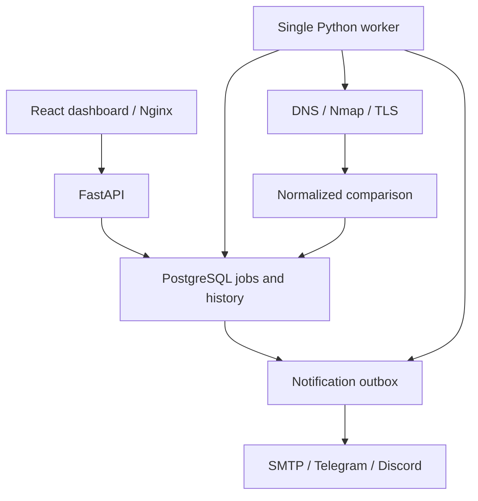

# Architecture

## Components

Routers authenticate, validate and queue requests. Scanning, comparison, persistence
and delivery live in independent modules. The worker polls durable timestamps
instead of registering volatile recurring jobs. Jobs can later be consumed by a
queue adapter without rewriting the scanner or comparison engine.

## Observation and trust

`Snapshot` is a deterministic Pydantic representation: state, observation time,
resolved addresses, sorted ports, per-address TCP states, DNS records, certificates
and errors. JSON snapshots are the complete evidence; normalized child tables
support later searches. Completed snapshots cannot be replaced through the API or
scan completion service. Ordinary PostgreSQL administrative access can alter data;
this is application immutability, not cryptographic tamper evidence.

`Target.baseline_scan_id` references a complete SUCCESS scan. Comparisons use that
pointer, not merely the most recent scan. FAILED/PARTIAL never advance it. When a
closure is proposed, a candidate row counts consecutive complete observations.
Until the threshold is met, the whole trusted baseline stays in place. This favors
low false positives at the cost of temporary lag in trusted service display.

An explicit `closed` observation is necessary for REMOVED_PORT. An absent IP,
smaller profile, timeout, filtered response or missing XML element is insufficient.
Profiles are immutable; changing the target's host/profile resets its baseline
without erasing history. Diff comparisons only include overlapping endpoint scope.

Nmap's omitted-port summaries are expanded only when one unambiguous summary's
count exactly matches missing requested ports. Otherwise the scan is uncertain.
The parser rejects timed-out, incomplete, mismatched-address, malformed or failed
XML, and defusedxml rejects entity expansion and external entity attacks.

## Confirmation and deduplication

NEW_PORT and reliably observed service changes emit immediately. REMOVED_PORT
requires the configured consecutive complete scans (default two). Failed/partial
observations clear closure candidates. Profiles and historical evidence remain intact.

The comparison engine returns normalized event proposals. Persistence stores a
stable event fingerprint based on type and structured evidence. Active fingerprints
suppress the same ongoing condition, including a repeated scan failure or unchanged
expiry warning. FAILED/PARTIAL retain latches because they cannot prove resolution;
a later complete SUCCESS absence permits a new occurrence. Warnings
use certificate fingerprint and threshold band rather than daily remaining-day text.
Version/product fields are compared only when both observations populated them and
the scanner's confidence is sufficient; metadata loss/enrichment alone is uncertain.

## TLS and DNS

Domains resolve A, AAAA and CNAME once. All address sets must pass the address policy
before scanning begins. Address limits cause failure instead of silent truncation.
The worker scans validated numeric IPs and uses the original hostname for TLS SNI.
DNS record ordering, casing and trailing dots are normalized. CNAME TTL and record
TTL are intentionally excluded to avoid noisy countdown differences.

TLS collection observes direct TLS on identified SSL tunnels and common TLS ports.
It does not send application data. Verification is disabled for this observation
connection so expired/self-signed certificates can still be inspected. This does
not validate chain trust: `chain_valid=false` means not assessed. Hostname monitoring
supports exact SAN DNS/IP matches, one-label wildcards and documented legacy CN
fallback. Renewal means a changed fingerprint with a later expiry, not issuer trust.
Days remaining use ceiling; actual expiry uses the exact UTC instant.

## Tables

| Table | Purpose |
|---|---|
| users / auth_sessions | Argon2 account hashes; expiring HMAC-hashed opaque sessions |
| targets | Ownership, host, schedule, enabled/archive and baseline pointer |
| scan_profiles | Immutable bounded TCP port scopes |
| scans | Job state, timestamps, captured scope and immutable snapshot |
| scan_services | Per-scan endpoint states and service metadata |
| tls_certificates | Per-scan certificate evidence and indexed expiry/fingerprint |
| dns_records | Per-scan normalized record sets |
| change_candidates | Consecutive successful closure observations |
| change_events | Normalized severity, evidence, acknowledgment and time |
| alert_rules | Owner, channel, recipient, severity and enabled state |
| notifications | Durable payload, delivery state, retry count and sanitized error |

Alembic adds query indexes, foreign keys, a partial unique active-job index and a
partial unique active-target/owner/host index. The circular baseline foreign key is
created after `scans` on PostgreSQL. UTC timezone-aware timestamps are used throughout.

## Worker lifecycle

The V1 worker acquires a dedicated session advisory lock before recovery, scheduling
or delivery. At startup and serial tick boundaries it marks orphaned RUNNING jobs
FAILED, including a prior failed completion transaction. It claims queued
jobs using `FOR UPDATE SKIP LOCKED`; enqueue uses a savepoint and the partial unique
index to handle manual/scheduled overlap without discarding other transaction work.
Scan history, events, baseline promotion and notification outbox entries commit
together. Delivery runs separately; failure never changes the completed scan.
Completion locks target then scan, refreshes persisted identities and rejects
late results for completed jobs, preserving immutability across recovery.

SMTP delivery can be fully local. Telegram/Discord destinations come only from
operator-controlled environment settings. No arbitrary webhook URL is accepted via
the API. Retry delivery is at least once: an interruption after external delivery
but before its database commit can resend a notification. Local jobs are durable,
but V1 does not run parallel workers or promise high-throughput monitoring.

SIGTERM requests graceful shutdown after the current tick. SIGKILL can leave a
committed RUNNING scan; startup recovery marks it FAILED, records SCAN_FAILED,
clears closure candidates and preserves the trusted baseline. CI tests the real
kill/restart path on the disposable Docker project.

## Demo networking and channel status

The HTTP/TLS lab joins only internal `lab` and has no published ports. Mailpit
joins `lab` and `default`: SMTP is reached internally at `mailpit:1025`, while its
inspection UI alone is published at `127.0.0.1:8025`. The normal bridge avoids the
internal-only publishing behavior on the reported Docker Engine setup.

One demo environment anchor gives backend and worker identical SMTP configuration.
The authenticated status endpoint returns only booleans and reports configuration
availability, not reachability. Telegram/Discord credentials remain environment-only.
Changing `.env` requires recreating both API and worker.
